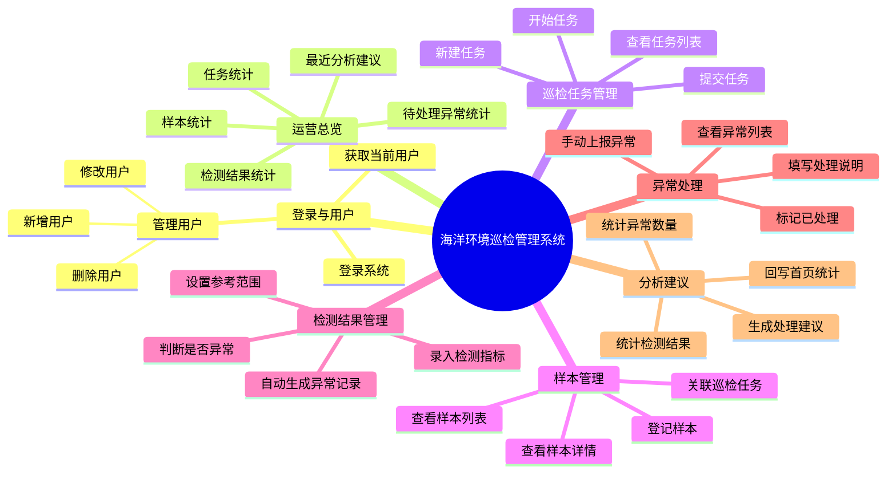

# 海洋环境巡检课程设计系统

本项目是面向本科课程设计和答辩的简化版海洋环境巡检系统。系统保留原项目的技术方向：后端使用 PHP/Laravel，前端使用 React + TypeScript + Vite；同时去掉企业级项目中不适合课程展示的复杂能力，让团队成员能理解、能运行、能讲清楚。

核心业务链如下：

```text
巡检任务 -> 样本登记 -> 检测结果录入 -> 异常上报处理 -> 简单分析建议 -> 首页统计
```

## 项目定位

- **课程目标：** 展示一个前后端分离的业务管理系统，而不是复制完整企业平台。
- **业务场景：** 海洋巡检人员创建巡检任务，登记水质样本，录入检测结果；系统根据阈值发现异常，给出简单分析建议，并在首页汇总统计。
- **技术特点：** Laravel 提供 API、模型、迁移和种子数据；React/Vite 提供管理后台页面；SQLite 作为默认本地数据库，方便课堂演示。
- **答辩重点：** 讲清楚业务流程、数据库关系、接口设计、前后端分工和演示路径。


## 系统功能结构图



系统功能按“登录与用户、运营总览、巡检任务、样本、检测结果、异常处理、分析建议”组织。答辩讲解时可以沿着图中的业务链说明：先创建任务，再登记样本，之后录入检测结果，系统发现异常后进入处理流程，最后生成分析建议并在首页汇总。

## 技术栈

| 模块 | 技术 | 说明 |
| --- | --- | --- |
| 后端 | PHP、Laravel | 提供 REST API、数据库迁移、模型和种子数据 |
| 前端 | React、TypeScript、Vite | 实现后台页面、表格、表单和统计卡片 |
| 数据库 | SQLite | 默认本地演示数据库，降低部署门槛 |
| 接口格式 | JSON | 前后端通过 `/api/*` 接口通信 |
| 文档 | Markdown | 支持队友阅读、分工和答辩准备 |

## 推荐页面

1. **首页统计：** 展示任务数、样本数、异常数、最近分析建议。
2. **巡检任务：** 创建任务、开始任务、提交任务。
3. **样本管理：** 登记样本、查看样本详情。
4. **检测结果：** 录入 pH、盐度、溶解氧、温度等检测值。
5. **异常与分析：** 上报异常、处理异常、生成简单分析建议。
6. **系统说明：** 展示系统介绍、业务流程和平台定位。

## 文档导航

- [项目概览](./docs/01-project-overview.md)
- [需求说明](./docs/02-requirements.md)
- [系统设计](./docs/03-system-design.md)
- [数据与 API 设计](./docs/04-data-api-design.md)
- [前后端设计](./docs/05-frontend-backend-design.md)
- [运行指南](./docs/06-run-guide.md)
- [答辩演示脚本](./docs/07-demo-script.md)
- [团队协作模板](./docs/08-team-work-template.md)
- [常见问题](./docs/09-faq.md)
- [分工 1：PHP 总体架构、接口入口、数据库设计统筹与前端集成](./docs/team-01-architecture-frontend.md)
- [分工 2：PHP 核心业务控制器与异常分析逻辑](./docs/team-02-php-core-business.md)
- [分工 3：PHP 单表结构、基础模型与种子数据讲解](./docs/team-03-php-database-easy.md)
- [分工 4：PHP 登录接口、运行命令与测试结果讲解](./docs/team-04-php-auth-test-easy.md)

## 本地运行

### 方式一：Docker 启动后端（推荐）

如果本机 PHP/Composer 环境不稳定，优先使用 Docker/Podman Compose：

```bash
docker compose up --build backend
```

后端地址：`http://127.0.0.1:8000`。容器会自动安装 Composer 依赖、创建 `.env`、生成 `APP_KEY`、创建 SQLite 数据库并执行迁移和种子数据。

如需重置演示数据：

```bash
docker compose exec backend php artisan migrate:fresh --seed
```

### 方式二：本机启动后端

```bash
cd backend
composer install
cp .env.example .env
php artisan key:generate
touch database/database.sqlite
php artisan migrate --seed
php artisan serve
```

后端默认地址通常为：`http://127.0.0.1:8000`。

### 前端

```bash
cd frontend
pnpm install
pnpm run dev
```

前端默认地址通常为：`http://127.0.0.1:5173`。

## 答辩演示流程

1. 打开首页统计，说明业务链：巡检任务、样本、检测结果、异常、分析建议。
2. 创建或选择一个巡检任务，并点击开始。
3. 登记一个样本，说明样本属于某个巡检任务。
4. 为样本录入检测结果，说明结果字段和异常判断依据。
5. 提交或触发异常，展示异常状态。
6. 处理异常，填写处理说明。
7. 对样本运行简化分析，生成建议。
8. 返回首页统计，展示数据变化。

## 简化原则

本项目为了适合课程设计，明确不加入以下内容：Redis 队列、Python Worker、完整 RBAC 权限系统、审计日志、图片上传或图像识别、Docusaurus 文档站、Docker 优先部署、复杂 i18n、过度抽象的 Service 层。

## 目录说明

```text
ocean-course-design/
├── backend/          # Laravel 后端
├── frontend/         # React + Vite 前端
├── docs/             # 课程设计和答辩文档
├── AGENTS.md         # 项目约束和代理说明
└── README.md         # 项目入口文档
```

## 给队友的阅读建议

第一次阅读建议按以下顺序：先看 `README.md`，再看需求说明、系统设计、数据与 API 设计，最后看运行指南和答辩演示脚本。这样可以先理解「为什么做」，再理解「怎么做」和「怎么讲」。
