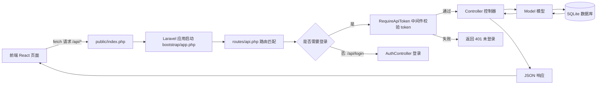
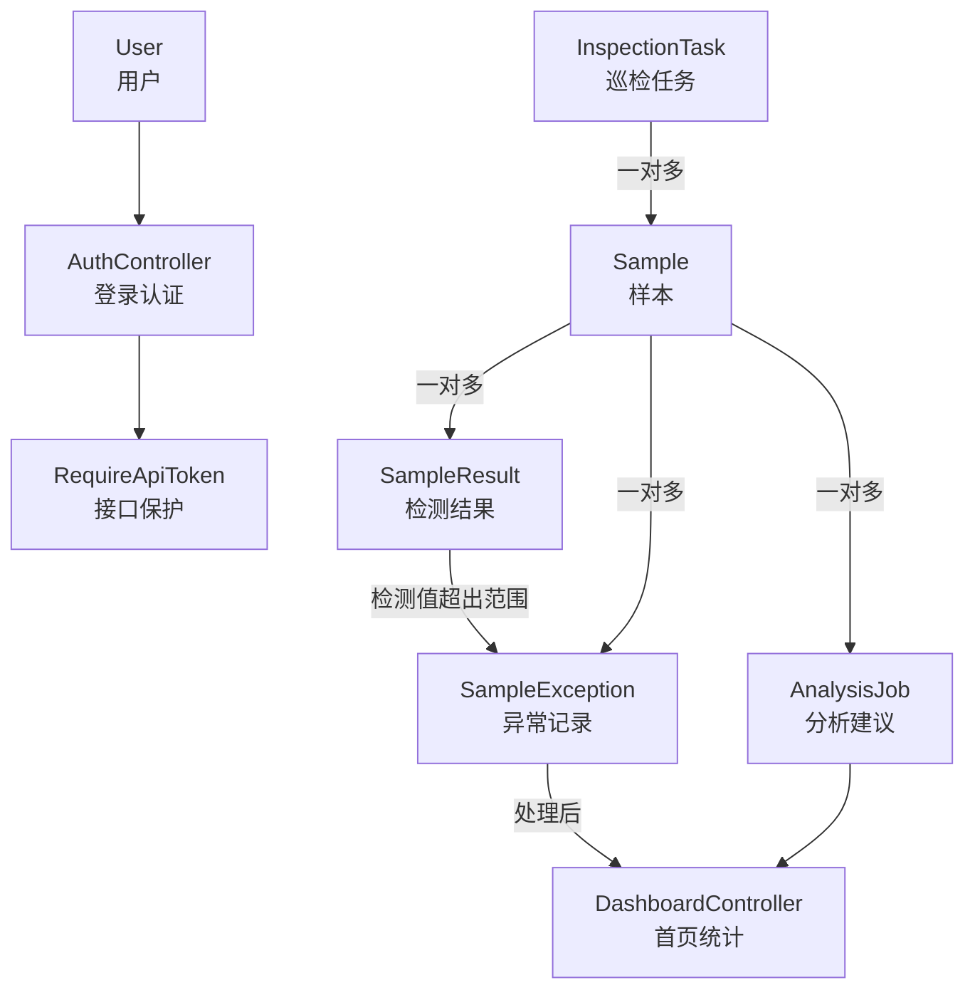
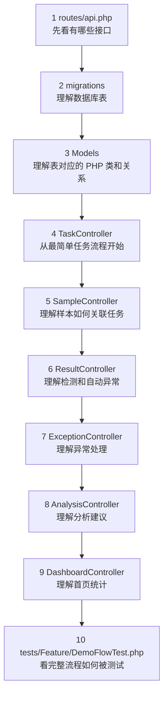

# Ocean Course Design 后端说明

这不是 Laravel 官方 README，而是本项目后端的阅读导航。它的目标是让第一次接触 Laravel 的同学知道：哪些文件是框架自动生成的，哪些文件是我们课程项目真正需要理解和讲解的。

## 1. 后端负责什么

本后端使用 PHP + Laravel 实现海洋巡检管理平台的数据接口，主要职责是：

- 接收前端请求，例如新建巡检任务、登记样本、录入检测结果。
- 校验前端提交的数据，防止空值、重复编号、错误日期等脏数据进入数据库。
- 使用 Eloquent ORM 操作 SQLite 数据库。
- 根据检测值和参考范围判断是否异常。
- 自动生成异常记录和分析建议。
- 提供登录 token 校验，让业务接口不是裸露的。

核心业务链：

```text
巡检任务 -> 样本登记 -> 检测结果 -> 异常处理 -> 分析建议 -> 首页统计
```

## 2. 后端文件结构导航

下面的文件树把“我们需要重点理解的项目代码”和“Laravel 自动生成/框架支撑代码”分开标注。

```text
backend/
├── app/                                      # 应用核心代码目录
│   ├── Http/
│   │   ├── Controllers/                     # 【项目重点】API 控制器：接收请求、处理业务、返回 JSON
│   │   │   ├── AuthController.php           # 登录、退出、根据 token 获取用户
│   │   │   ├── UserController.php           # 简化用户管理：管理员增删改查用户
│   │   │   ├── DashboardController.php      # 首页统计：任务、样本、结果、异常、分析建议
│   │   │   ├── TaskController.php           # 巡检任务：创建、开始、提交、查询
│   │   │   ├── SampleController.php         # 样本：登记、列表、详情
│   │   │   ├── ResultController.php         # 检测结果：录入指标、判断异常、自动生成异常
│   │   │   ├── ExceptionController.php      # 异常：上报、列表、处理
│   │   │   ├── AnalysisController.php       # 分析：根据检测结果和异常状态生成建议
│   │   │   └── Controller.php               # Laravel 控制器基类，本项目基本不需要讲
│   │   └── Middleware/
│   │       └── RequireApiToken.php          # 【项目重点】简化版 API 登录校验中间件
│   ├── Models/                              # 【项目重点】Eloquent 模型：对应数据库表和表关系
│   │   ├── User.php                         # 用户模型，对应 users 表
│   │   ├── InspectionTask.php               # 巡检任务模型，对应 inspection_tasks 表
│   │   ├── Sample.php                       # 样本模型，对应 samples 表
│   │   ├── SampleResult.php                 # 检测结果模型，对应 sample_results 表
│   │   ├── SampleException.php              # 异常记录模型，对应 exceptions 表
│   │   └── AnalysisJob.php                  # 分析记录模型，对应 analysis_jobs 表
│   └── Providers/
│       └── AppServiceProvider.php           # Laravel 服务提供者，本项目基本保持默认
├── bootstrap/
│   ├── app.php                              # Laravel 启动配置；本项目在这里注册 auth.simple 中间件
│   └── providers.php                        # Laravel 服务提供者列表，通常不用讲
├── config/                                  # Laravel 配置目录，多数为框架默认配置
│   ├── app.php                              # 应用配置
│   ├── auth.php                             # 认证配置，本项目主要用自写 token 逻辑
│   ├── database.php                         # 数据库配置，会读取 .env 中的 DB 设置
│   └── ...                                  # 其他缓存、日志、邮件、队列配置
├── database/
│   ├── migrations/                          # 【项目重点】迁移：用 PHP 代码创建数据库表
│   │   ├── 0001_01_01_000000_create_users_table.php
│   │   │                                      # 用户表：name、email、password、role、api_token_hash
│   │   └── 2026_06_11_000001_create_ocean_demo_tables.php
│   │                                          # 业务表：任务、样本、结果、异常、分析
│   ├── seeders/
│   │   └── DatabaseSeeder.php               # 【项目重点】初始数据：管理员账号、任务、样本、结果等
│   ├── factories/
│   │   └── UserFactory.php                  # 测试中快速生成用户
│   └── database.sqlite                      # SQLite 数据库文件，本地运行时使用
├── routes/
│   ├── api.php                              # 【项目重点】API 路由：前端所有 /api/* 请求从这里进入
│   ├── web.php                              # Laravel Web 路由，本项目主要做 API，基本不用讲
│   └── console.php                          # 命令行路由，基本不用讲
├── tests/
│   ├── Feature/                             # 【项目重点】功能测试：模拟 HTTP 请求验证业务流程
│   │   ├── AuthUserManagementTest.php       # 登录和用户管理测试
│   │   └── DemoFlowTest.php                 # 从任务到分析建议的完整业务流程测试
│   ├── Unit/                                # 单元测试目录，本项目只保留默认示例
│   └── TestCase.php                         # Laravel 测试基类
├── public/
│   └── index.php                            # Web 入口，浏览器请求会先进入这里，再交给 Laravel
├── resources/
│   └── views/welcome.blade.php              # Laravel 默认欢迎页，本项目不依赖它
├── storage/                                 # 日志、缓存、临时文件，运行时生成，不要重点讲
├── vendor/                                  # Composer 第三方依赖，自动安装，不要手改
├── .env.example                             # 环境变量示例；真正运行时复制为 .env
├── artisan                                  # Laravel 命令行入口，例如 php artisan test
├── composer.json                            # PHP 依赖声明
├── composer.lock                            # PHP 依赖锁定文件
└── README.md                                # 当前后端说明文档
```

一句话区分：

> 真正和我们项目业务强相关的是 `routes/api.php`、`app/Http/Controllers/`、`app/Http/Middleware/`、`app/Models/`、`database/migrations/`、`database/seeders/` 和 `tests/Feature/`。其他目录多数是 Laravel 框架运行所需的骨架或配置。

## 3. Laravel 请求流向图



这张图可以帮助理解 Laravel 后端的执行顺序：前端请求不会直接进入数据库，而是先经过路由、中间件、控制器，再通过模型访问数据库。

## 4. 本项目业务模块关系图



答辩时可以这样讲：巡检任务是起点，任务下面有样本；样本下面有检测结果、异常记录和分析建议；首页统计会汇总这些数据。

## 5. 推荐阅读顺序

如果你第一次接触 Laravel，建议按这个顺序看：



## 6. 关键 Laravel 概念速查

### Route 路由

文件：`routes/api.php`

作用：把 URL 和控制器方法连接起来。

例子：

```php
Route::get('/tasks', [TaskController::class, 'index']);
```

含义：前端访问 `GET /api/tasks` 时，Laravel 执行 `TaskController` 的 `index()` 方法。

### Controller 控制器

目录：`app/Http/Controllers/`

作用：接收请求、校验数据、调用模型读写数据库、返回 JSON。

### Model 模型

目录：`app/Models/`

作用：一个模型通常对应一张数据表。例如 `Sample` 对应 `samples` 表。

### Migration 迁移

目录：`database/migrations/`

作用：用 PHP 代码创建或回滚数据库表结构。

### Seeder 数据填充

文件：`database/seeders/DatabaseSeeder.php`

作用：生成初始数据，方便本地运行和讲解。

### Middleware 中间件

文件：`app/Http/Middleware/RequireApiToken.php`

作用：在进入控制器前先检查登录 token。

### Feature Test 功能测试

目录：`tests/Feature/`

作用：模拟真实 HTTP 请求，验证接口流程是否正确。

## 7. 本项目 API 总览

### 登录

| 方法 | 地址 | 说明 |
| --- | --- | --- |
| `POST` | `/api/login` | 登录，返回 token |
| `GET` | `/api/me` | 获取当前登录用户 |
| `POST` | `/api/logout` | 退出登录 |

### 业务接口

这些接口都需要登录 token：

| 方法 | 地址 | 说明 |
| --- | --- | --- |
| `GET` | `/api/dashboard` | 首页统计 |
| `GET` | `/api/tasks` | 任务列表 |
| `POST` | `/api/tasks` | 新建任务 |
| `POST` | `/api/tasks/{task}/start` | 开始任务 |
| `POST` | `/api/tasks/{task}/submit` | 提交任务 |
| `GET` | `/api/samples` | 样本列表 |
| `POST` | `/api/samples` | 登记样本 |
| `GET` | `/api/samples/{sample}` | 样本详情 |
| `POST` | `/api/samples/{sample}/results` | 录入检测结果 |
| `GET` | `/api/results` | 检测结果列表 |
| `GET` | `/api/exceptions` | 异常列表 |
| `POST` | `/api/exceptions` | 手动上报异常 |
| `POST` | `/api/exceptions/{exception}/resolve` | 处理异常 |
| `POST` | `/api/samples/{sample}/analyze` | 生成分析建议 |

## 8. 本地运行

```bash
cd backend
composer install
cp .env.example .env
php artisan key:generate
touch database/database.sqlite
php artisan migrate:fresh --seed
php artisan serve
```

登录账号：

```text
邮箱：admin@ocean.local
密码：password
```

## 9. 常用命令

### 重建数据库并填充数据

```bash
php artisan migrate:fresh --seed
```

### 启动后端服务

```bash
php artisan serve
```

### 查看 API 路由

```bash
php artisan route:list --path=api
```

### 运行测试

```bash
php artisan test
```

## 10. 答辩时可用的一句话

> 我们后端使用 Laravel 的路由、控制器、模型、迁移、Seeder、中间件和测试，完成了从巡检任务到样本、检测结果、异常处理、分析建议和首页统计的完整闭环；其中 Laravel 默认生成了项目骨架，我们主要编写的是 `routes/api.php`、`app/Http/Controllers`、`app/Http/Middleware`、`app/Models`、`database` 和 `tests/Feature` 这些和业务直接相关的代码。
