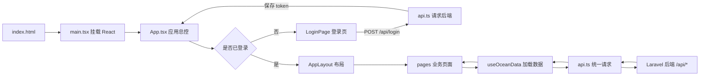
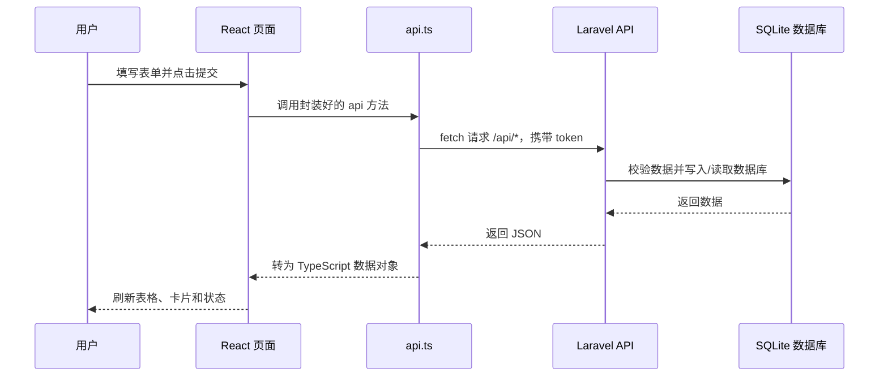
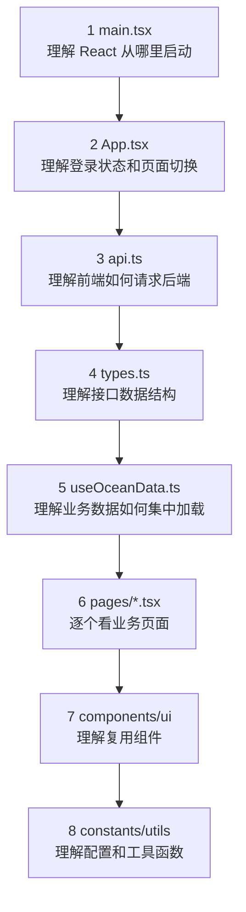

# Ocean Course Design 前端说明

这是海洋环境巡检管理平台的前端说明文档。它不是 Vite 默认 README，而是给第一次接触 React + TypeScript + Vite 的同学准备的阅读导航。

## 1. 前端负责什么

前端负责把后端提供的海洋巡检数据展示给用户，并提供表单让用户完成业务操作。主要职责包括：

- 登录系统并保存登录令牌。
- 请求 Laravel 后端 `/api/*` 接口。
- 展示首页统计、巡检任务、样本、检测结果、异常处理和用户管理页面。
- 通过表单提交数据，例如新建任务、登记样本、录入检测结果。
- 根据后端返回的数据刷新页面。

前端不直接访问数据库，所有数据都必须通过后端 API 获取。

## 2. 前端技术栈

- React：负责组件化页面。
- TypeScript：给接口数据和组件参数加类型约束。
- Vite：负责开发服务器和打包构建。
- CSS / Tailwind 工具类：负责页面样式。
- Fetch API：负责向 Laravel 后端发送 HTTP 请求。

## 3. 前端文件结构导航

```text
frontend/
├── index.html                         # Vite HTML 入口，页面根节点在这里
├── package.json                       # 前端依赖和脚本，例如 pnpm run dev / pnpm run build
├── vite.config.ts                     # Vite 配置
├── tsconfig*.json                     # TypeScript 配置
├── public/                            # 静态资源目录
├── dist/                              # 构建产物，pnpm run build 后生成，不要手改
└── src/                               # 【项目重点】前端源码
    ├── main.tsx                       # React 挂载入口，把 App 渲染到 index.html
    ├── App.tsx                        # 【项目重点】应用总控：登录状态、页面切换、整体布局
    ├── api.ts                         # 【项目重点】统一封装后端 API 请求和 token 处理
    ├── types.ts                       # 【项目重点】前后端数据结构类型定义
    ├── index.css                      # 全局样式
    ├── mockData.ts                    # 空数据结构保底；真实数据来自后端 API
    ├── hooks/
    │   └── useOceanData.ts            # 【项目重点】统一加载 dashboard/tasks/samples/results/exceptions
    ├── pages/                         # 【项目重点】业务页面
    │   ├── LoginPage.tsx              # 登录页
    │   ├── DashboardPage.tsx          # 运营总览页
    │   ├── TasksPage.tsx              # 巡检任务页
    │   ├── SamplesPage.tsx            # 样本管理页
    │   ├── ResultsPage.tsx            # 检测结果页
    │   ├── ExceptionsPage.tsx         # 异常处理与分析页
    │   ├── UsersPage.tsx              # 用户管理页
    │   └── AboutPage.tsx              # 系统说明页
    ├── layout/                        # 页面布局组件
    │   ├── AppLayout.tsx              # 侧边栏 + 顶部栏 + 内容区
    │   ├── Sidebar.tsx                # 左侧导航
    │   └── Topbar.tsx                 # 顶部标题栏
    ├── components/ui/                 # 可复用 UI 组件
    │   ├── Badge.tsx                  # 状态标签
    │   ├── DataCard.tsx               # 卡片容器
    │   ├── DataTable.tsx              # 通用表格
    │   ├── FormField.tsx              # 输入框、选择框、文本域
    │   └── MetricCard.tsx             # 首页指标卡片
    ├── constants/
    │   ├── navigation.ts              # 菜单页面配置
    │   └── status.ts                  # 状态文字和颜色映射
    └── utils/
        ├── dashboard.ts               # 首页统计数据整理函数
        └── form.ts                    # 表单转对象工具函数
```

一句话区分：

> `src/App.tsx`、`src/api.ts`、`src/hooks/`、`src/pages/`、`src/types.ts` 是答辩重点；`dist/` 是构建产物，`node_modules/` 是依赖目录，通常不用讲也不要手改。

## 4. 前端运行流程图



## 5. 前后端数据流图



## 6. 推荐阅读顺序



## 7. 页面和文件对应关系

| 页面 | 文件 | 说明 |
| --- | --- | --- |
| 登录 | `src/pages/LoginPage.tsx` | 登录并保存 token |
| 运营总览 | `src/pages/DashboardPage.tsx` | 展示统计、异常结果、近期异常 |
| 巡检任务 | `src/pages/TasksPage.tsx` | 创建、修改、开始、提交、删除任务 |
| 样本管理 | `src/pages/SamplesPage.tsx` | 登记样本并展示样本列表 |
| 检测结果 | `src/pages/ResultsPage.tsx` | 录入指标和参考范围 |
| 异常分析 | `src/pages/ExceptionsPage.tsx` | 上报异常、处理异常、生成建议 |
| 用户管理 | `src/pages/UsersPage.tsx` | 管理员创建、切换、删除用户 |
| 系统说明 | `src/pages/AboutPage.tsx` | 说明平台流程和定位 |

## 8. 本地运行

```bash
cd frontend
pnpm install
pnpm run dev
```

默认接口地址：

```text
http://127.0.0.1:8000/api
```

如果后端地址不同，可以创建 `.env.local`：

```bash
VITE_API_BASE_URL=http://127.0.0.1:8000/api
```

构建检查：

```bash
pnpm run build
```

## 9. 答辩时可用的一句话

> 前端使用 React + TypeScript + Vite 实现后台管理界面，`App.tsx` 负责登录状态和页面切换，`api.ts` 统一请求 Laravel 后端，`useOceanData.ts` 统一加载业务数据，各个 `pages` 页面负责具体业务操作，用户提交的数据会通过 API 写入后端 SQLite 数据库。
