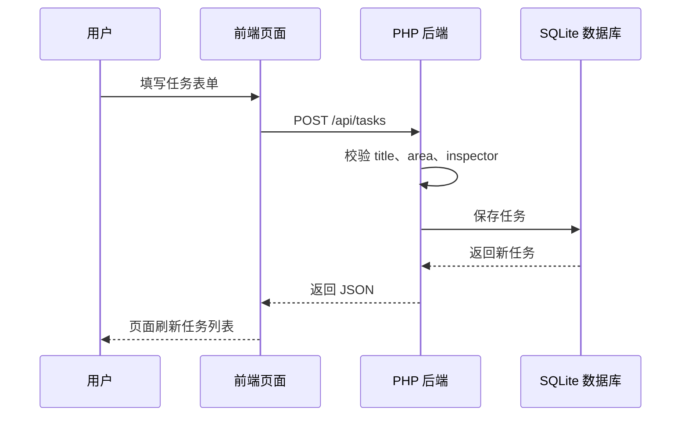

# 网页、PHP 后端、数据库怎么配合

先把三个角色分清楚。

## 前端是什么？

前端就是你在浏览器里看到的页面。

在本项目里，前端代码在：

```text
frontend/
```

它负责：

- 显示按钮、表单、表格。
- 让用户填写任务、样本、检测结果。
- 把用户填写的数据发给后端。
- 把后端返回的数据展示出来。

## 后端是什么？

后端就是 PHP/Laravel 写的接口服务。

在本项目里，后端代码在：

```text
backend/
```

它负责：

- 接收前端请求。
- 检查数据是否合理。
- 判断检测结果是否异常。
- 读写数据库。
- 返回 JSON 给前端。

## 数据库是什么？

数据库就是保存数据的地方。

本项目用 SQLite，文件大概是：

```text
backend/database/database.sqlite
```

它保存：

- 用户。
- 巡检任务。
- 样本。
- 检测结果。
- 异常记录。
- 分析建议。

## 一次“新建任务”发生了什么？



## 最重要的一句话

> 前端负责展示和提交，PHP 后端负责判断和保存，数据库负责长期存储。
