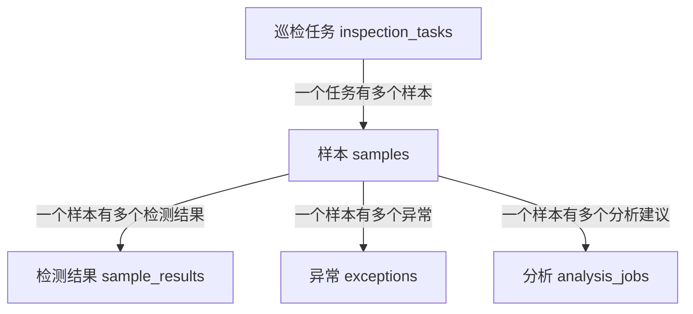

# 表之间是什么关系

表关系听起来难，其实先记住一句话：

> 一个任务有多个样本，一个样本有多个检测结果、异常记录和分析建议。

## 关系图



## 什么是一对多？

一对多就是：一条数据对应多条数据。

例子：

- 一个巡检任务，可以有多个样本。
- 一个样本，可以有多个检测指标。

## 什么是外键？

外键就是“这条数据属于谁”的编号。

例如 samples 表里有：

```text
inspection_task_id
```

它表示这个样本属于哪个巡检任务。

## 为什么样本是中心？

因为检测结果、异常、分析建议都围绕样本发生。

没有样本，就不知道检测值、异常和建议是针对哪份水样。

## 项目代码在哪里体现？

Model 关系：

```text
InspectionTask.php  -> samples()
Sample.php          -> task()
Sample.php          -> results()
Sample.php          -> exceptions()
Sample.php          -> analyses()
```

## 必背说法

> 外键用来表示数据归属。样本通过 `inspection_task_id` 归属于任务，检测结果、异常和分析建议通过 `sample_id` 归属于样本。
