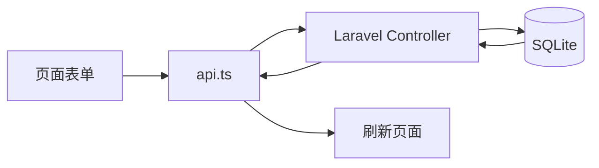

# 前端如何调用后端

## 前端关键文件

- `frontend/src/App.tsx`：控制登录和页面切换。
- `frontend/src/api.ts`：统一封装后端请求。
- `frontend/src/hooks/useOceanData.ts`：统一加载业务数据。
- `frontend/src/pages/*.tsx`：业务页面。

## api.ts 的作用

页面不要直接写 `fetch`，而是调用 `api.ts` 里的方法：

```ts
api.getTasks()
api.createSample(data)
api.addResult(sampleId, data)
```

这样可以统一处理：

- API 地址。
- JSON 请求头。
- token。
- 错误提示。

## 数据刷新

页面提交成功后会调用：

```ts
await onChanged()
```

`onChanged` 实际上就是 `useOceanData` 里的 `refreshAll()`，会重新请求后端数据。

## 表单到数据库



## 答辩说法

> 前端页面通过 `api.ts` 调用 PHP 后端接口，登录后请求会自动携带 token。提交表单后，Laravel 后端会校验数据并写入数据库，前端再刷新列表和统计。
