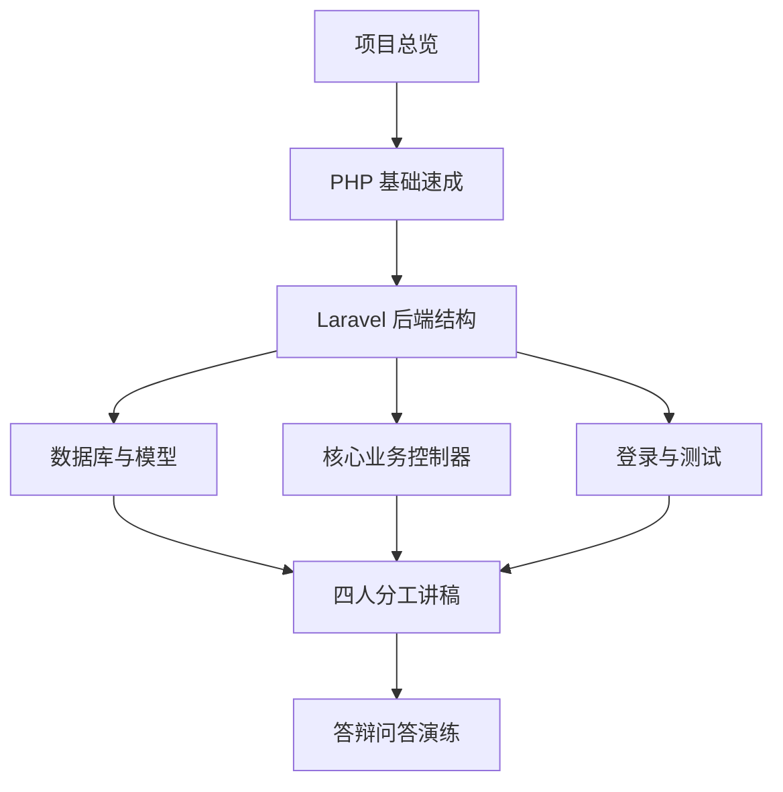

# Ocean 课程设计补课站

这个文档站面向本组成员，用来在答辩前快速补齐各自负责部分的基础知识。它不会替代项目根目录已有的 `docs/`，而是把“需要学会讲什么、背什么、怎么应对追问”整理成更适合线上阅读的文档站。

## 学习目标

- 看懂项目的前后端分离结构。
- 理解 PHP/Laravel 后端的路由、控制器、模型、迁移、Seeder 和测试。
- 明确每个人负责的答辩范围。
- 遇到老师追问时知道该怎么回答，或者如何交给对应负责人兜底。

## 推荐学习顺序

## 四人分工建议

| 成员 | 负责方向 | 难度 | 重点 |
| --- | --- | --- | --- |
| 杨栋森 | PHP 总体架构、接口入口、数据库设计统筹、前端集成 | 高 | 负责主线串联和兜底 |
| 基础较强组员 | PHP 核心业务控制器与异常分析逻辑 | 高 | 负责任务、样本、检测、异常、分析 |
| 基础薄弱组员 A | 单表结构、基础模型、Seeder | 低 | 负责可背诵的数据结构 |
| 基础薄弱组员 B | 登录接口、运行命令、测试结果 | 低 | 负责可演示的验证部分 |

## 本站内容导航

- [项目总览](./overview/project-flow.md)
- [PHP 基础速成](./php-basics/syntax.md)
- [Laravel 后端结构](./laravel/backend-map.md)
- [数据库与模型](./laravel/database-models.md)
- [核心业务控制器](./laravel/controllers.md)
- [登录与测试](./laravel/auth-testing.md)
- [前端如何调用后端](./frontend/api-flow.md)
- [四人分工讲稿](./team/role-1-lead.md)
- [答辩问答演练](./defense/faq.md)
