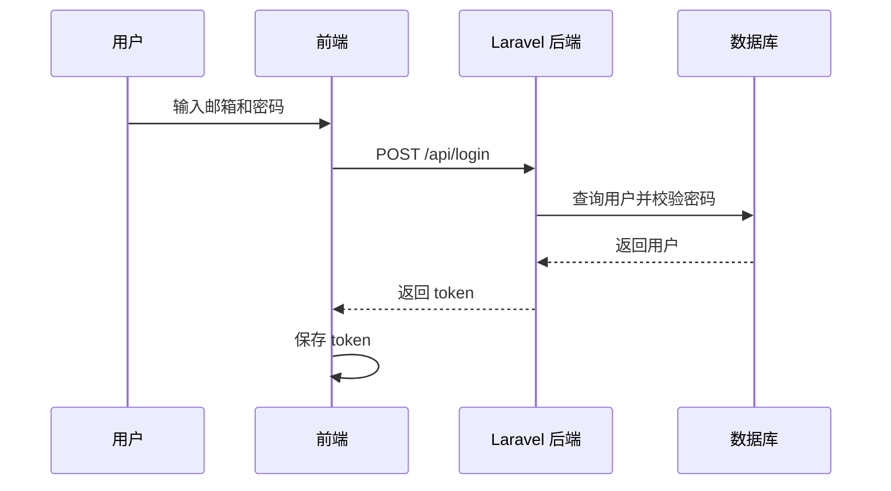

# 登录、权限与测试

## 登录流程



## token 是什么

token 可以理解为登录后的临时凭证。前端访问业务接口时会携带 token，后端通过 token 判断用户是否登录。

## 中间件保护接口

除 `/api/login` 外，业务接口都经过 `auth.simple` 中间件：

```php
Route::middleware('auth.simple')->group(function (): void {
    Route::get('/dashboard', [DashboardController::class, 'show']);
});
```

如果没有合法 token，后端返回 401。

## 为什么要测试

测试可以证明功能真的跑通，而不是只写了页面。

运行命令：

```bash
cd backend
php artisan test
```

当前测试覆盖：

- 登录。
- 当前用户。
- 用户管理权限。
- 完整业务流程。
- 未登录访问业务接口会失败。

## 答辩说法

> 登录成功后后端返回 token，前端后续请求携带 token。Laravel 中间件会统一校验 token，未登录不能访问业务接口。我们还用 Feature Test 验证了完整业务流程。
