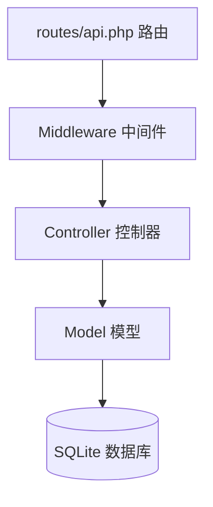

# Laravel 后端结构

## Laravel 后端主线



## 各目录作用

```text
backend/
├── routes/api.php              # API 路由入口
├── app/Http/Controllers/       # 控制器，处理请求
├── app/Http/Middleware/        # 中间件，登录校验
├── app/Models/                 # 模型，对应数据库表
├── database/migrations/        # 迁移，创建表结构
├── database/seeders/           # 种子数据，生成初始数据
└── tests/Feature/              # 功能测试，验证接口流程
```

## 路由 Route

```php
Route::get('/tasks', [TaskController::class, 'index']);
```

含义：当前端访问 `GET /api/tasks` 时，Laravel 执行 `TaskController@index`。

## 控制器 Controller

控制器负责：

- 接收请求。
- 校验数据。
- 调用模型。
- 返回 JSON。

## 模型 Model

模型对应数据库表。例如：

- `InspectionTask` 对应 `inspection_tasks` 表。
- `Sample` 对应 `samples` 表。
- `SampleResult` 对应 `sample_results` 表。

## 迁移 Migration

迁移用 PHP 代码创建数据库表：

```php
Schema::create('samples', function (Blueprint $table) {
    $table->id();
    $table->string('code')->unique();
});
```

## Seeder

Seeder 用来生成初始数据，方便运行和演示。

## 答辩说法

> Laravel 后端按照路由、控制器、模型、数据库的结构组织。路由负责分发请求，控制器负责业务逻辑，模型负责数据库操作，迁移负责建表，Seeder 负责初始化数据。
