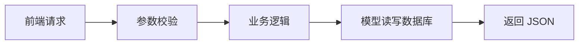

# 核心业务控制器

## 控制器的作用

控制器负责处理前端请求，是 PHP 后端业务逻辑最集中的地方。



## TaskController

负责巡检任务：

- 查询任务列表。
- 新建任务。
- 开始任务。
- 提交任务。

关键词：`create`、`update`、`withCount`。

## SampleController

负责样本：

- 查询样本列表。
- 登记样本。
- 查看样本详情。

重点：样本必须关联任务。

## ResultController

负责检测结果：

- 录入检测指标。
- 根据参考范围判断异常。
- 如果异常，自动生成异常记录。

核心判断：

```php
if ($min !== null && $value < $min) return true;
if ($max !== null && $value > $max) return true;
```

## ExceptionController

负责异常：

- 查询异常。
- 手动上报异常。
- 处理异常并记录处理说明。

## AnalysisController

负责分析建议：

- 统计检测结果数量。
- 统计异常指标数量。
- 统计待处理异常数量。
- 生成建议文字。

## DashboardController

负责首页统计：

- 任务总数。
- 样本总数。
- 检测结果总数。
- 待处理异常数。
- 分析记录数。

## 答辩说法

> 控制器是后端业务逻辑入口。前端提交数据后，控制器先校验参数，再调用模型写入数据库，最后返回 JSON 给前端。
