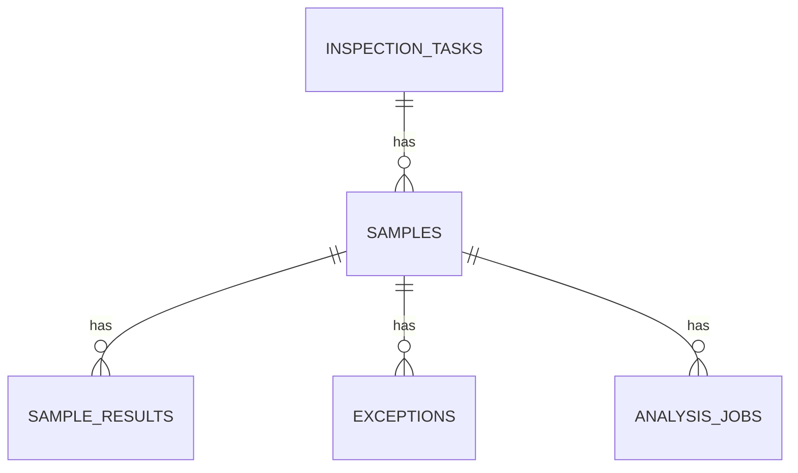

# 数据库与模型

## 本项目数据表

| 表 | 作用 |
| --- | --- |
| users | 用户 |
| inspection_tasks | 巡检任务 |
| samples | 样本 |
| sample_results | 检测结果 |
| exceptions | 异常记录 |
| analysis_jobs | 分析建议 |

## 表关系



## 为什么这样设计

- 一个任务可以有多个样本。
- 一个样本可以有多条检测结果。
- 一个样本可以有多条异常记录。
- 一个样本可以生成多条分析建议。

## Model 中的关系

```php
public function samples(): HasMany
{
    return $this->hasMany(Sample::class);
}
```

表示一个任务有多个样本。

```php
public function task(): BelongsTo
{
    return $this->belongsTo(InspectionTask::class);
}
```

表示一个样本属于一个任务。

## fillable 是什么

```php
protected $fillable = ['title', 'area', 'inspector'];
```

表示这些字段允许通过表单/API 批量写入。

## casts 是什么

```php
protected function casts(): array
{
    return ['is_abnormal' => 'boolean'];
}
```

表示 Laravel 会自动把字段转换成指定类型。

## 答辩说法

> 我们用 Eloquent 模型表示数据库表，用 `hasMany` 和 `belongsTo` 表示表关系，用 migration 创建表结构，用 seeder 生成初始数据。
