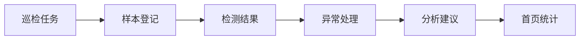
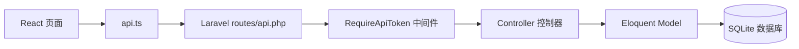

# 项目总览：系统是怎么跑起来的

## 一句话介绍

本项目是一个海洋环境巡检管理系统，使用 React 前端和 PHP/Laravel 后端实现。用户可以创建巡检任务、登记样本、录入检测结果、处理异常，并在首页查看统计数据和分析建议。

## 业务流程

## 技术流程

## 你需要记住的主线

1. 前端页面负责展示和收集表单。
2. `api.ts` 把表单数据发送到 Laravel 后端。
3. `routes/api.php` 把请求分发给控制器。
4. 控制器校验数据并调用模型。
5. 模型读写 SQLite 数据库。
6. 后端返回 JSON，前端刷新页面。

## 答辩时可以这样说

> 我们的项目不是静态页面，而是一个前后端分离的管理系统。前端通过 API 调用 PHP/Laravel 后端，后端使用模型操作 SQLite 数据库，完成从巡检任务到样本、检测结果、异常处理和首页统计的闭环。
